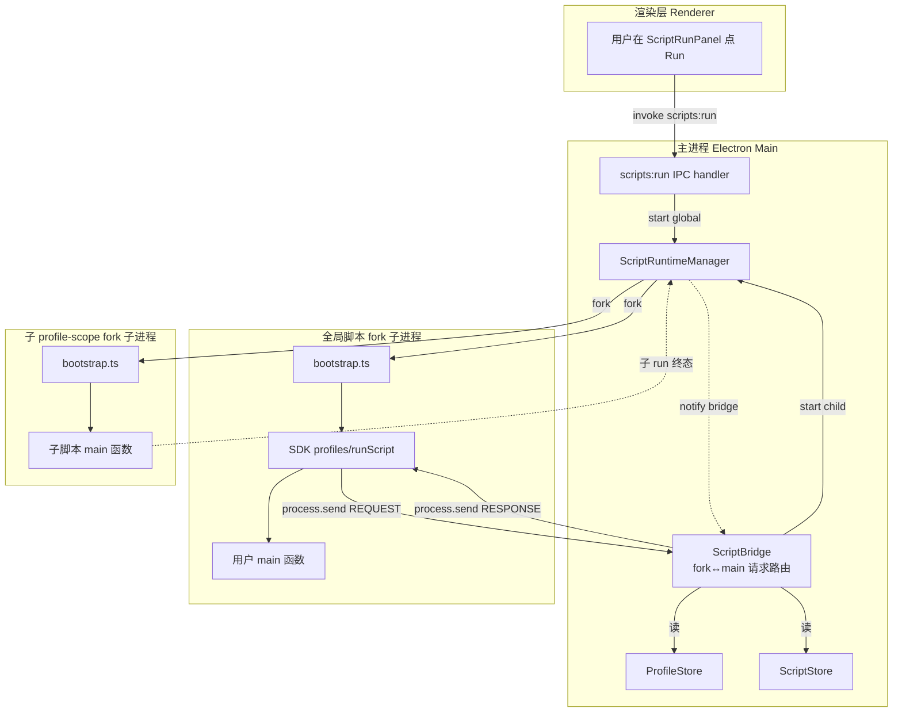
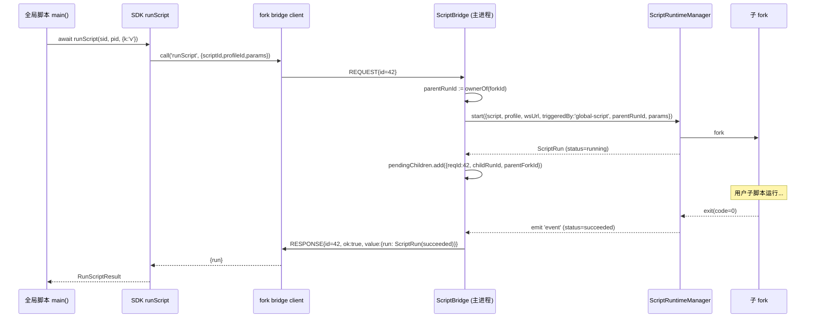

# Design · global-scripts-and-queues / Phase 6 — 全局脚本 SDK 实装(profiles + runScript)

> 真源 spec: [`docs/specs/global-scripts-and-queues.md`](../../../docs/specs/global-scripts-and-queues.md) §5 + §8 phase 6
> 上一阶段: [`.kiro/specs/global-scripts-and-queues/tasks.md`](../global-scripts-and-queues/tasks.md) (phase 3,已完成)
>
> 目标:把 `import { profiles, runScript } from 'auto-registry'` 从"throw GLOBAL_NOT_IMPL_YET 占位"
> 升级为真实可用。phase 1+2 已经把数据字段 (`Script.scope` / `ScriptRun.triggeredBy/parentRunId/params`)
> 与 SDK 类型骨架就位;phase 3 把 `main(args)` 协议接通。本阶段只做"真正能跑起来"那一步。

## Overview

phase 6 要让如下用户代码端到端工作:

```ts
import { profiles, runScript, log } from 'auto-registry'

export default async function main(args) {
  const all = await profiles.list()
  for (const p of all) {
    const result = await runScript('someScriptId', p.id, { keyword: 'demo' })
    log(p.name, '→', result.run.status)
  }
}
```

为此需要打通三件事:

1. **fork ↔ main 双向 IPC 通道**:fork 子进程当前只 `process.send` 上行(log/lifecycle),
   缺一条"调用主进程能力并 await 结果"的下行 / 上下行链路。本阶段新增 plain-JSON + 单调
   correlation id 的请求/响应协议。
2. **SDK 全局分支接入 IPC**:`makeGlobalScopeProfilesApi` / `runScript` 当前都 throw
   `GLOBAL_NOT_IMPL_YET`,本阶段把 `list / get` 与 `runScript` 改成走新通道;
   `create / delete / setQueue` 仍保留占位(写 API 涉及队列校验、id 校验、fingerprint
   默认值,放到后续阶段单独评审)。
3. **父子 run 联动**:全局 run 是父,通过 `runScript` 触发的 profile run 是子。
   父 run 被 stop 时,主进程必须**也**停掉当前 await 中的所有子 run,且 fork 内部
   `runScript()` 调用要 `reject` 一个带 code 的错误,让用户的 try/catch 能拿到。

## 范围(In/Out)

**In(本阶段必须做)**:

- `profiles.list()` / `profiles.get(id)` → 走 IPC 读 ProfileStore 真实数据(只读)
- `runScript(scriptId, profileId, params?)` → 主进程 fork 子 run、await 终态、把
  `ScriptRun` 终态对象返回给父进程的 fork
- 父子 run 链路:子 run `triggeredBy='global-script'` + `parentRunId=父 run id`,
  落到 ScriptRun 持久化(phase 1 字段已就位,这里只是真正写入)
- 停止传播:全局 run 被 stop → 主进程 stop **当前所有** 由它触发且未完成的子 run;
  fork 内 `runScript` 的 await 以 `ScopeMismatchError(code='SCRIPT_STOPPED')` reject
- IPC 错误码统一:`PROFILE_NOT_FOUND` / `SCRIPT_NOT_FOUND` / `INVALID_SCOPE`
  (尝试 `runScript` 一个 `scope='global'` 脚本) / `PROFILE_BUSY`(透传现有错误) /
  `SCRIPT_STOPPED`(停止传播)
- IPC 通道注册时机、释放时机、孤儿处理(fork 退出时主进程要清空挂起的请求 / 联动子 run)

**Out(明确不做)**:

- `profiles.create / profiles.delete / profiles.setQueue` —— 写 API 涉及队列脚本
  scope 校验、profile id 冲突、fingerprint 默认值、删 profile 时的运行 / 浏览器副作用,
  每条都需要单独的设计评审。本阶段保持 `GLOBAL_NOT_IMPL_YET`,在 SDK 占位错误的 message
  里加一句 "tracked in phase 6.x" 让用户读到能去翻进度。
- phase 4 队列编辑 UI、phase 5 onCreate/onLaunch 触发 —— 本阶段 `runScript` 只服务于
  "全局脚本主动调度子 run"这一条手动触发路径;onCreate/onLaunch 是另一阶段的工作。
- 子 run 的实时日志流式回放给全局 fork —— 用户脚本里目前只关心 `run.status`,
  日志由 ActiveRunsButton 抽屉走原有渲染路径展示;本阶段 fork 内不订阅子 run 的日志事件。
- 引入新依赖、新进程 / 新协议层(WebSocket / gRPC 之类)。Node 自带的 `process.send`
  / `process.on('message')` 已够用。

## Architecture



关键不变量:

- 渲染层 → 主进程 IPC(`scripts:run` 等)签名**不动**。本阶段新增的 IPC 是
  fork ↔ main 的内部协议,渲染层无感。
- 全局 fork 与子 fork 各自独立。子 fork 是父 fork 通过 `runScript` 触发的"专用 profile
  run",生命周期归 `ScriptRuntimeManager`,不归全局 fork。
- 互斥规则不变:子 run 仍走 `getActiveByProfile` 检查;若 profile 已被占用,主进程把
  `PROFILE_BUSY` 通过 IPC response 回传,fork 里 `runScript` reject。

## Sequence Diagrams

### 4.1 `profiles.list()` 调用全链路

```mermaid
sequenceDiagram
    participant User as 用户脚本 main()
    participant SDK as SDK profiles.list (fork 内)
    participant FBus as fork bridge client
    participant IPC as ScriptBridge (主进程)
    participant PS as ProfileStore

    User->>SDK: await profiles.list()
    SDK->>FBus: call('profiles.list', {})
    FBus->>FBus: id := nextId() ; pending.set(id, {resolve, reject})
    FBus->>IPC: process.send({kind:'request', id, method:'profiles.list', payload:{}})
    IPC->>PS: store.list()
    PS-->>IPC: BrowserProfile[]
    IPC->>FBus: process.send({kind:'response', id, ok:true, value: BrowserProfile[]})
    FBus->>FBus: pending.get(id).resolve(value) ; pending.delete(id)
    FBus-->>SDK: BrowserProfile[]
    SDK-->>User: Readonly<BrowserProfile>[]
```

### 4.2 `runScript()` 正常路径



### 4.3 父 run 被 stop → 子 run 联动

```mermaid
sequenceDiagram
    participant UI as 用户(渲染层)
    participant RT as ScriptRuntimeManager
    participant Bridge as ScriptBridge
    participant FBus as fork bridge client (父 fork)
    participant SDK as 父 fork SDK runScript
    participant Child as 子 run

    UI->>RT: stop(parentRunId)
    RT->>RT: SIGTERM 父 fork
    Note over Bridge: bridge 监听 RT 的 'active-changed';<br/>发现父 run 不再活跃 →<br/>对所有 pendingChildren(parentForkId) 联动
    Bridge->>RT: stop(childRunId) (并行所有挂起的子 run)
    Bridge->>FBus: RESPONSE{id=42, ok:false, error:{code:'SCRIPT_STOPPED', ...}}
    FBus->>SDK: pending.get(42).reject(ScopeMismatchError('SCRIPT_STOPPED'))
    SDK-->>父 fork: throw
    Note over 父 fork: 父 fork 自己也在被 SIGTERM,<br/>用户 try/catch 可拿到 SCRIPT_STOPPED;<br/>没 catch 就和 stopSignal abort 路径汇合
    Child->>RT: exit (status=stopped)
```

> 设计要点:即便父 fork 已经被 SIGTERM,bridge 仍要把 RESPONSE 发出去再断。原因是父
> fork 退出有 graceful 窗口(3s,与 phase 1 的 GRACEFUL_SHUTDOWN_MS 一致),期间用户
> 代码的 try/catch 仍可执行;reject 让 catch 块拿到明确 code,比"await 永远 hang 直到
> SIGKILL"友好得多。

## Components and Interfaces

### 5.1 `ScriptBridge`(新模块,主进程)

**职责**:在主进程持有 fork 通道,路由请求/响应,联动停止。

**位置**:`electron/scripts/bridge.ts`(新文件)

**接口**:

```ts
import type { BrowserProfile, ScriptRun } from '../types'
import type { ScriptStore } from './store'
import type { ScriptRuntimeManager } from './runtime'
import type { ProfileStore } from '../store'
import type { ChildProcess } from 'node:child_process'

/** fork 与 main 之间的请求/响应方法清单 */
export type BridgeMethod =
  | 'profiles.list'
  | 'profiles.get'
  | 'runScript'

/** request 信封 */
export interface BridgeRequest {
  kind: 'request'
  id: number               // 单调递增,fork 侧生成;每个 fork 独立计数
  method: BridgeMethod
  payload: unknown
}

/** response 信封 */
export interface BridgeResponse {
  kind: 'response'
  id: number               // 与对应 request.id 严格相等
  ok: boolean
  /** ok=true 时的结果值;序列化必须只含可 JSON 化字段 */
  value?: unknown
  /** ok=false 时的错误。code 必须是已知集合中的字符串 */
  error?: { code: string; message: string; [k: string]: unknown }
}

export class ScriptBridge {
  constructor(
    runtime: ScriptRuntimeManager,
    scriptStore: ScriptStore,
    profileStore: ProfileStore,
    /** 与 main.ts 里现有的 ensureProfileRunningForScript 复用同一实现 */
    ensureProfileRunningForScript: (profile: BrowserProfile) => Promise<string>
  )

  /**
   * 注册一个新 fork 进程到 bridge:挂上 'message' 监听,记录 forkId↔runId 映射,
   * 在 fork 'exit' 时清理所有挂起的状态。
   *
   * 由 ScriptRuntimeManager.start() 在 fork 创建后立即调用。
   */
  attach(child: ChildProcess, ownerRunId: string): void

  /**
   * 在 ScriptRuntimeManager 'active-changed' 时被 main.ts 拉取调用:
   * 比较新旧活跃集合,对消失的 ownerRunId 触发"父 run 终止 → 联动其挂起的子 run"。
   *
   * 也可由 bridge 自己订阅 runtime 'event';二选一,设计上倾向 bridge 自订阅,
   * 减少 main.ts 的胶水代码。
   */
  onParentRunFinished(parentRunId: string): Promise<void>

  /** 应用退出时调用,断开所有 fork channel,reject 所有 pending */
  shutdown(): void
}
```

**职责拆分**:

- `attach`:每条 fork 进来时,挂 `child.on('message', ...)` 处理 BridgeRequest;挂
  `child.on('exit', ...)` 做清理。
- 内部维护两张表:
  - `forks: Map<runId, { child, pendingChildren: Set<{childRunId, reqId}> }>`
    —— 每个 fork 当前正在 await 的子 run 集合
  - `(没必要存 pending 的 request id 集合,因为 request 一收到立刻处理,异步等待
    的只有 runScript 那种"等子 run 终态"的场景,这部分由 pendingChildren 表达)`
- 父 fork 因为任何原因退出(用户 stop / 异常退出 / 用户脚本正常完成):清理它的
  pendingChildren,对所有未完成子 run 调 `runtime.stop(childRunId)`,并向那条
  fork 的 channel 写一个 SCRIPT_STOPPED RESPONSE(尽力而为,channel 已断也无所谓)。

**为何独立成模块而不是直接塞 ScriptRuntimeManager**:Runtime 现在只关心"启动 / 停止 /
状态广播"这一条主线;再叠加 IPC 路由会让它的职责膨胀,且多 fork 协作的 pending 状态
跟 run 状态正交。把 bridge 抽出来,Runtime 不感知 fork 间关系,bridge 不感知日志/状态
广播,各自单测和演化都更好。

### 5.2 `bootstrap.ts` 内的 fork bridge 客户端

**职责**:在 fork 内提供 `call(method, payload)` 函数给 SDK 用;管理 pending 表、
correlation id、超时(无超时,等到 fork 被 SIGTERM 时由 bridge 清理)。

**接口**(`electron/scripts/sdk/bridge-client.ts`,新文件;bootstrap 引入并提供给
`createScriptApi`):

```ts
import type { BridgeMethod } from '../bridge'

export interface BridgeClient {
  call<T>(method: BridgeMethod, payload: unknown): Promise<T>
  /** 进程退出 / 父 channel 断开时,reject 全部 pending */
  dispose(reason: string): void
}

/**
 * 工厂:绑定到当前 process 的 IPC channel(process.send + process.on('message'))。
 * 必须在 main() 早期调用,即在用户代码加载之前 —— SDK factory 需要它。
 *
 * 设计要点:
 *   - id := monotonic counter, 起始 1, 每次 call() 自增。fork 在自己进程内独占,
 *     不需要 UUID。
 *   - 任何 RESPONSE 没匹配到 pending 的(例如已经超时清理)→ 静默丢弃,记 warn 日志。
 *   - parent disconnect 时 dispose() 一次性 reject 全部 pending,理由 'parent disconnected'。
 */
export function createBridgeClient(): BridgeClient
```

`bootstrap.ts` 关键修改:

```ts
// 在 readBootstrapEnv / readBootstrapArgs 之后、createScriptApi 之前
const bridge = createBridgeClient()
const context: ScriptContext = {
  // ...既有字段
  bridge   // 新增
}
const api = createScriptApi(context)

process.on('disconnect', () => {
  bridge.dispose('parent disconnected')
  // 既有的 process.exit(1) 逻辑保留
})
```

### 5.3 `createScriptApi` 修改

**变更点**(`electron/scripts/sdk/index.ts`):

- `ScriptContext` 类型加 `bridge: BridgeClient | null`(profile-scope 不需要 → null
  也可,但简单起见统一注入)。
- `makeGlobalScopeProfilesApi(bridge)` 改为接收 bridge,实装 `list` / `get`,
  `create / delete / setQueue` 仍 throw `GLOBAL_NOT_IMPL_YET`。
- 全局 scope 的 `runScript` 改为:`(scriptId, profileId, params) =>
  bridge.call<RunScriptResult>('runScript', { scriptId, profileId, params })`。
- 失败路径:`bridge.call` reject 出来的是结构化错误,SDK 把它包装成
  `ScopeMismatchError(error.code, error.message)`(沿用 phase 2 的错误类),
  让用户 try/catch 时拿到一致的 `e.code`。

接口(精确签名):

```ts
function makeGlobalScopeProfilesApi(bridge: BridgeClient): ProfilesApi {
  return {
    list: () => bridge.call<BrowserProfile[]>('profiles.list', {}),
    get: (id: string) => bridge.call<BrowserProfile | null>('profiles.get', { id }),
    create: () => notImplementedYet('create'),
    delete: () => notImplementedYet('delete'),
    setQueue: () => notImplementedYet('setQueue')
  }
}

function makeGlobalRunScript(bridge: BridgeClient): ScriptApi['runScript'] {
  return (scriptId, profileId, params) =>
    bridge.call<RunScriptResult>('runScript', { scriptId, profileId, params: params ?? {} })
}
```

### 5.4 `ScriptRuntimeManager.start` 修改

唯一改动:fork 创建后,**立刻**调用 `bridge.attach(child, run.id)`,把这条 fork 注册
进 bridge,以便后续 IPC 路由 + 父子 run 联动。

伪代码 diff:

```ts
const child = fork(bootstrapPath, [], { ... })
+ this.bridge?.attach(child, run.id)        // 新增:挂 IPC 监听 + 记 forkId
const abort = new AbortController()
```

`ScriptRuntimeManager` 构造函数加 `bridge?: ScriptBridge` 可选参数(避免循环依赖:
bridge 也持 runtime 引用 → 用 setter 注入更干净):

```ts
runtime.setBridge(bridge)        // main.ts 中,先 new runtime,再 new bridge,再注回 runtime
```

### 5.5 `main.ts` 改动

```ts
// 1. 构造 bridge,顺序:proxyStore → profileStore → scriptStore → runtime → bridge
scriptRuntime = new ScriptRuntimeManager(scriptStore)
const bridge = new ScriptBridge(scriptRuntime, scriptStore, store, ensureProfileRunningForScript)
scriptRuntime.setBridge(bridge)

// 2. 应用退出时清理
app.on('before-quit', () => {
  // 既有 scriptRuntime.shutdown() / terminateAllProfileBrowsers()
  bridge.shutdown()
})
```

`scripts:run` IPC handler **不变** —— 它只负责"渲染层 → 主进程"那一跳;fork 内调
`runScript` 走 bridge,与渲染层路径并列。

## Data Models

### 6.1 BridgeRequest / BridgeResponse 字段细则

```ts
// REQUEST 一定是 fork → main
type BridgeRequest = {
  kind: 'request'
  id: number              // fork 内单调递增,从 1 起
  method: BridgeMethod    // 见 §5.1
  payload: unknown        // 每个 method 形状不同,参考 §6.2
}

// RESPONSE 一定是 main → fork
type BridgeResponse =
  | { kind: 'response'; id: number; ok: true; value: unknown }
  | { kind: 'response'; id: number; ok: false; error: BridgeError }

type BridgeError = {
  code: BridgeErrorCode
  message: string
  /** 各 code 可能附带的字段(比如 PROFILE_BUSY 的 occupiedBy) */
  [k: string]: unknown
}

type BridgeErrorCode =
  | 'PROFILE_NOT_FOUND'
  | 'SCRIPT_NOT_FOUND'
  | 'INVALID_SCOPE'         // 试图 runScript 一个 scope='global' 的脚本
  | 'PROFILE_BUSY'          // 透传 ProfileBusyError
  | 'SCRIPT_STOPPED'        // 父 run 被 stop,联动到子 run 的 await
  | 'GLOBAL_NOT_IMPL_YET'   // create/delete/setQueue 占位
  | 'INTERNAL_ERROR'        // 兜底:bridge 自身异常
```

**为什么 error 是带字段的对象而不是 throw 一个字符串**:phase 1 已经在 `ProfileBusyError`
上有 `code` 字段,后续 `runScript` 的失败需要 `occupiedBy` 这种附加上下文给用户做决策,
统一信封比"序列化 Error 实例"更稳。

### 6.2 各 method 的 payload / value 形状

| method | payload | success value | 可能的 error code |
| --- | --- | --- | --- |
| `profiles.list` | `{}` | `BrowserProfile[]` | `INTERNAL_ERROR` |
| `profiles.get` | `{ id: string }` | `BrowserProfile \| null` | `INTERNAL_ERROR` |
| `runScript` | `{ scriptId, profileId, params: object }` | `{ run: ScriptRun }`(终态) | `SCRIPT_NOT_FOUND` / `PROFILE_NOT_FOUND` / `INVALID_SCOPE` / `PROFILE_BUSY` / `SCRIPT_STOPPED` |

**`profiles.list` value 的形状细则**:返回完整 `BrowserProfile[]` —— 与 `window.registry.profiles.list()`
渲染层 IPC 一致。SDK 类型层在 `index.ts` 包一层 `Object.freeze` 给用户读到只读快照。
**不**做字段裁剪 —— 用户脚本可能依赖 `enabledPluginIds` / `proxyId` / `fingerprint`
来决策。

**`runScript` value 的形状细则**:`{ run: ScriptRun }`,与 §5 spec 与 SDK 类型一致;
`run.status` 必为 `'succeeded' | 'failed' | 'stopped'` 之一(终态)。

### 6.3 Validation Rules

- **Bridge 协议层**(`bridge.ts` 内):
  - 收到 `process.message` 时,先检查 `kind === 'request'` 且 `typeof id === 'number'`
    且 `method` 在白名单。任一不通过 → 静默丢弃 + 记 warn(防御 fork 进程内存错乱)。
  - 每个 method 单独校验 payload(简单 typeof / in 操作,不引 zod)。
- **Fork 客户端层**(`bridge-client.ts` 内):
  - 收到 RESPONSE 时,检查 `kind === 'response'` + `id ∈ pending`。匹配不到 → 丢弃 + 记 warn。
  - `id` 单调递增的不变量由"全局 counter"保证,无需运行时验证。

## 算法伪代码 / Key Functions with Formal Specifications

### 7.1 `ScriptBridge.attach`

```ts
attach(child: ChildProcess, ownerRunId: string): void
```

**Preconditions**:

- `child` 已 `fork` 启动,且其 `stdio` 配置含 `'ipc'`(由 ScriptRuntimeManager 保证)。
- `ownerRunId` 是 ScriptStore 中已 `createRun` 出来的合法 id。
- 同一个 `ownerRunId` 不会被 attach 两次(由 ScriptRuntimeManager 调用方保证)。

**Postconditions**:

- `forks` 表新增 `ownerRunId → { child, pendingChildren: new Set() }` 条目。
- `child.on('message', ...)` 注册 bridge 的 request 处理器。
- `child.on('exit', ...)` 注册清理逻辑:
  - 删除 `forks[ownerRunId]` 条目
  - 对 pendingChildren 中每个 `childRunId`,异步调 `runtime.stop(childRunId)`(若该子 run 仍活跃)
  - 不再尝试向已退出的 `child` 发送 RESPONSE(IPC 已断)

**Loop Invariants**:N/A(无显式循环)

### 7.2 `ScriptBridge.handleRequest`(message handler 内部函数)

```pascal
ALGORITHM handleRequest(child, ownerRunId, request)
INPUT:
  child         — fork ChildProcess
  ownerRunId    — 该 fork 对应的全局 run id
  request       — BridgeRequest 已通过协议层校验
OUTPUT: void(异步发出 RESPONSE)

BEGIN
  TRY
    SWITCH request.method
      CASE 'profiles.list':
        value ← profileStore.list()
        send RESPONSE { id: request.id, ok: true, value }

      CASE 'profiles.get':
        ASSERT typeof request.payload.id === 'string'
        value ← profileStore.get(request.payload.id) ?? null
        send RESPONSE { id: request.id, ok: true, value }

      CASE 'runScript':
        result ← AWAIT executeRunScript(ownerRunId, request.id, request.payload)
        // executeRunScript 内部已经发 RESPONSE,这里直接 return
        return

      DEFAULT:
        send RESPONSE { id: request.id, ok: false, error: { code: 'INTERNAL_ERROR', message: 'unknown method' } }
    END SWITCH
  CATCH e:
    send RESPONSE { id: request.id, ok: false, error: serializeBridgeError(e) }
  END TRY
END
```

**Preconditions**:

- `ownerRunId` 仍在 `forks` 表(未 detach)。
- `request.id` 在该 fork 内未与之前任何 request 冲突(由 fork 单调 counter 保证)。

**Postconditions**:

- 恰好向 `child` 发送一条 RESPONSE,`response.id === request.id`。
- 任何同步 / 异步异常都被翻译成 `error.code` 已知的 BridgeError;**不**抛回到 Node
  事件循环(否则会把主进程拖崩)。

### 7.3 `ScriptBridge.executeRunScript`

```pascal
ALGORITHM executeRunScript(parentRunId, reqId, payload)
INPUT:
  parentRunId   — 触发 runScript 的全局 run id
  reqId         — bridge request id,用于回复 RESPONSE
  payload       — { scriptId, profileId, params }
OUTPUT: void(异步发 RESPONSE)
PRECONDITIONS:
  - forks[parentRunId] 存在(否则父 fork 已退出,本算法不该被调用)
POSTCONDITIONS:
  - 必发恰好一条 RESPONSE 给父 fork
  - 子 run 的终态被持久化(由 ScriptRuntimeManager 完成)
  - pendingChildren[parentRunId] 中本次条目最终被移除(无论成功 / 失败 / 被联动停止)

BEGIN
  // —— 1) 同步校验 ——
  script ← scriptStore.get(payload.scriptId)
  IF script = null THEN
    send RESPONSE { id: reqId, ok: false, error: { code: 'SCRIPT_NOT_FOUND', message } }
    RETURN
  END IF

  IF script.scope = 'global' THEN
    send RESPONSE { id: reqId, ok: false, error: { code: 'INVALID_SCOPE', message } }
    RETURN
  END IF

  profile ← profileStore.get(payload.profileId)
  IF profile = null THEN
    send RESPONSE { id: reqId, ok: false, error: { code: 'PROFILE_NOT_FOUND', message } }
    RETURN
  END IF

  // —— 2) 启动子 run(可能抛 PROFILE_BUSY)——
  TRY
    wsUrl ← AWAIT ensureProfileRunningForScript(profile)
    childRun ← AWAIT runtime.start({
      script,
      profile,
      webSocketDebuggerUrl: wsUrl,
      triggeredBy: 'global-script',
      parentRunId,
      params: payload.params
    })
  CATCH e:
    IF e instanceof ProfileBusyError THEN
      send RESPONSE { id: reqId, ok: false, error: { code: 'PROFILE_BUSY', occupiedBy: e.occupiedBy, message: e.message } }
    ELSE
      send RESPONSE { id: reqId, ok: false, error: { code: 'INTERNAL_ERROR', message: e.message } }
    END IF
    RETURN
  END TRY

  // —— 3) 登记到 pendingChildren ——
  pending ← { reqId, childRunId: childRun.id }
  forks[parentRunId].pendingChildren.add(pending)

  // —— 4) 等子 run 终态 / 父 run 联动停止 ——
  finalRun ← AWAIT waitForChildTerminal(childRun.id, parentRunId)

  // —— 5) 移除 pending,发 RESPONSE ——
  forks[parentRunId]?.pendingChildren.delete(pending)

  IF finalRun.kind = 'terminal' THEN
    send RESPONSE { id: reqId, ok: true, value: { run: finalRun.run } }
  ELSE   // kind = 'parent-stopped'
    send RESPONSE { id: reqId, ok: false, error: { code: 'SCRIPT_STOPPED', message: 'parent run was stopped' } }
  END IF
END
```

**Loop Invariants**:`forks[parentRunId].pendingChildren` 在算法执行任意中间点都只
反映当前未完成的子 run 集合;算法结束时本次条目必被移除(成功 / 失败 / SCRIPT_STOPPED 三路汇合)。

### 7.4 `waitForChildTerminal`

```pascal
ALGORITHM waitForChildTerminal(childRunId, parentRunId)
INPUT:
  childRunId    — 已 start 的子 run id
  parentRunId   — 父 fork 的 run id;用于检测父 run 是否被 stop
OUTPUT:
  { kind: 'terminal', run: ScriptRun } | { kind: 'parent-stopped' }

BEGIN
  RETURN new Promise((resolve) => {
    onChildEvent ← (event) => {
      IF event.type = 'status' AND event.runId = childRunId AND isTerminal(event.status) THEN
        runtime.off('event', onChildEvent)
        offParentStop()
        // 从 ScriptStore 取持久化后的终态(ScriptRun 完整对象)
        resolve({ kind: 'terminal', run: scriptStore.findRunById(childRunId) ?? buildSyntheticFromEvent(event) })
      END IF
    }
    onParentStopped ← () => {
      runtime.off('event', onChildEvent)
      // 主动停子 run,但**不**等它终态;直接告诉调用方"父被停了"
      void runtime.stop(childRunId)
      resolve({ kind: 'parent-stopped' })
    }
    runtime.on('event', onChildEvent)
    offParentStop ← bridge.subscribeParentStopped(parentRunId, onParentStopped)
  })
END
```

**Preconditions**:

- `childRunId` 已经在 `runtime` 的活跃集合里,或马上会出现(start 已 await resolve)。
- `parentRunId` 仍活跃。

**Postconditions**:

- Promise 必 resolve(从不 reject);两条 listener 在退出前必被解绑 → 无内存泄漏。
- 'parent-stopped' 路径中,`runtime.stop(childRunId)` 是 fire-and-forget;子 run
  实际终态由 runtime 自己持久化,本路径不再 await。

**Loop Invariants**:N/A

### 7.5 fork 侧 `BridgeClient.call`

```pascal
ALGORITHM call(method, payload)
INPUT:
  method  — BridgeMethod
  payload — 任意可序列化对象
OUTPUT: Promise<T>
PRECONDITIONS:
  - process.send 函数存在(由 fork stdio 配置保证)
  - dispose() 尚未被调用
POSTCONDITIONS:
  - 返回的 Promise 最终 resolve(value) 或 reject(BridgeErrorPayload)
  - pending[id] 在 promise settle 后必被删除

BEGIN
  IF disposed THEN
    RETURN Promise.reject(new Error('bridge client disposed: ' + disposeReason))
  END IF

  id ← ++counter   // 单调,fork 进程内独占
  request ← { kind: 'request', id, method, payload }

  promise ← new Promise((resolve, reject) => {
    pending.set(id, { resolve, reject })
  })

  IF NOT process.send(request) THEN
    // process.send 同步返回 false 表示 channel 已死
    pending.delete(id)
    RETURN Promise.reject(new Error('parent IPC channel is closed'))
  END IF

  RETURN promise
END

ALGORITHM onMessage(message)
INPUT: any (process.on('message') payload)
BEGIN
  IF NOT (message?.kind = 'response' AND typeof message.id = 'number') THEN
    RETURN  // 非 bridge 消息,忽略
  END IF
  entry ← pending.get(message.id)
  IF entry = undefined THEN
    warn('orphan response', message.id)
    RETURN
  END IF
  pending.delete(message.id)
  IF message.ok THEN
    entry.resolve(message.value)
  ELSE
    entry.reject(message.error)
  END IF
END
```

## Example Usage

### 8.1 用户脚本视角(本阶段要支持的代码)

```ts
import { profiles, runScript, log, type ScriptMainArgs } from 'auto-registry'

interface MyParams { keyword: string }

export default async function main(args: ScriptMainArgs<MyParams>) {
  const all = await profiles.list()
  log('found', all.length, 'profiles')

  for (const p of all) {
    try {
      const result = await runScript('child_script_id', p.id, { keyword: args.params.keyword })
      log(p.name, '→', result.run.status, 'exit', result.run.exitCode ?? 'n/a')
    } catch (e: any) {
      // e.code: 'PROFILE_BUSY' / 'SCRIPT_NOT_FOUND' / 'PROFILE_NOT_FOUND' /
      //         'INVALID_SCOPE' / 'SCRIPT_STOPPED' / 'INTERNAL_ERROR'
      if (e.code === 'SCRIPT_STOPPED') return  // 父 run 被停,优雅退出
      log('skip', p.name, e.code, e.message)
    }
  }
}
```

### 8.2 Bridge 内部视角(主进程侧)

```ts
// main.ts 注册阶段
const runtime = new ScriptRuntimeManager(scriptStore)
const bridge = new ScriptBridge(runtime, scriptStore, profileStore, ensureProfileRunningForScript)
runtime.setBridge(bridge)

// runtime.start 内部(fork 后立即)
const child = fork(bootstrapPath, [], { ... })
this.bridge?.attach(child, run.id)
```

## Correctness Properties

> 本节会在 phase 6 实装期由验收清单覆盖;由于项目无自动测试框架,这里的"property"
> 形式给出**人工验证脚本**的剧本,而不是 fast-check / hypothesis 风格的自动化代码。
> 每条 property 都标注其在 [requirements.md](./requirements.md) 中对应的 acceptance
> criteria 编号。

### Property 1:Profiles 只读 API 与 Profile_Store 同源

*对任意* 当前 Profile_Store 状态 S 与 profile id `P`,在全局脚本里:
- `await profiles.list()` 等于 S 的全量快照(顺序、字段一致,且不裁剪
  `enabledPluginIds` / `proxyId` / `fingerprint` / `onCreateQueue` / `onLaunchQueue`)
- `await profiles.get(P)` 命中当且仅当 `P ∈ S`;不命中时 resolve 为 `null` 而非 reject

**Validates: Requirements 1.1, 1.2, 1.3, 1.4**

### Property 2:子 run 调度链字段写入

*对任意* 成功的 `runScript(scriptId, profileId, params)` 调用,生成的 Child_Run 在
持久化层(ScriptStore.listRuns)中满足:
- `triggeredBy === 'global-script'`
- `parentRunId === 当前全局 run id`
- `params` 与调用方传入对象等价(经 JSON 序列化往返后)
- 进入了 `forks[parentRunId].pendingChildren`,直到终态后才被移除

**Validates: Requirements 4.2, 4.6**

### Property 3:runScript 终态承诺

*对任意* 已 resolve 的 `runScript` 调用,`result.run.status` ∈
`{succeeded, failed, stopped}`;不会出现 `pending` / `running`。

**Validates: Requirements 4.4, 4.5**

### Property 4:错误码枚举闭合 + 映射

*对任意* fork 端 `runScript` 或 `profiles.*` reject 出来的错误对象 e:
- `e.code` ∈ `{PROFILE_NOT_FOUND, SCRIPT_NOT_FOUND, INVALID_SCOPE, PROFILE_BUSY, SCRIPT_STOPPED, GLOBAL_NOT_IMPL_YET, INTERNAL_ERROR}`
- `e` 是 Scope_Mismatch_Error 实例,`e.message` 来自 Bridge_Response.error.message
- 对每种入参错误条件(脚本不存在 / 脚本是 global / profile 不存在 / profile 被占),
  `e.code` 与设计 §6.1 表中映射严格一致

**Validates: Requirements 5.1, 5.2, 5.3, 5.4, 5.5, 5.6**

### Property 5:停止传播

*对任意* 全局 run R 和它已登记的挂起子 run 集合 C,当 R 因任何原因从 Script_Runtime
活跃集合移除时:
- 主进程对 ∀ c ∈ C 调用 `Script_Runtime.stop(c.childRunId)`
- R 的 fork 中 ∀ 对应 await 调用最终 reject 出 `code === 'SCRIPT_STOPPED'` 的
  Scope_Mismatch_Error
- 即便父 fork 已进入 SIGTERM 后的 graceful 窗口期,Script_Bridge 仍尝试发送
  SCRIPT_STOPPED Bridge_Response;IPC channel 已断时静默忽略写失败
- 启动新子 run 时若父已 stopped → 立即 stop 子 run + 回 SCRIPT_STOPPED

**Validates: Requirements 6.1, 6.2, 6.3, 6.4, 6.5**

### Property 6:Fork exit 清理

*对任意* fork 进程退出事件,无论触发原因(用户 stop / 用户脚本完成 / 异常崩溃 /
attach 期间立即退出),Script_Bridge 在 exit 处理结束后:
- `forks[ownerRunId]` 已被删除
- 所有 pendingChildren 中的 childRunId 都被 `Script_Runtime.stop` 调用过(可幂等)
- 不再向已退出的 child 发 Bridge_Response

**Validates: Requirements 3.3, 3.4**

### Property 7:写接口仍占位且无副作用

*对* `profiles.create` / `profiles.delete` / `profiles.setQueue` 三个方法,在全局
脚本里调用时:
- 抛出 Scope_Mismatch_Error 且 `code === 'GLOBAL_NOT_IMPL_YET'`
- error.message 包含 `phase 6.x` 字样
- 不发起任何 Bridge_Request(Script_Bridge 端无 message 到达)
- Profile_Store 内容、磁盘、子 fork 数量均不变

**Validates: Requirements 8.1, 8.2, 8.3**

### Property 8:Profile-scope SDK 不变量(回归保护)

*对任意* profile-scope 脚本,调 `profiles.*`(全部 5 个方法)与 `runScript` 时:
- 抛出 Scope_Mismatch_Error 且 `code === 'GLOBAL_NOT_AVAILABLE'`
- 不发起任何 Bridge_Request

**Validates: Requirements 7.2**

### Property 9:PROFILE_BUSY 互斥规则保留(回归保护)

*对任意* 当前已被某 ScriptRun 占用的 profile P,在全局脚本里调
`runScript(scriptId, P.id, params)` 时,reject 出来的错误满足
`e.code === 'PROFILE_BUSY'`,且不会启动新的 fork。

**Validates: Requirements 5.4, 7.3**

### Property 10:Correlation id 不串扰

*对任意* fork 内并发发起的 N(N ≥ 2)次 `bridge.call`:
- 每次调用获得的 id 严格大于该 fork 内此前所有调用的 id
- 各自得到的 Bridge_Response 必匹配自己的请求 id;不会出现"调用 A 拿到调用 B 的结果"
- 主进程发回的 Bridge_Response.id 与对应 Bridge_Request.id 严格相等

**Validates: Requirements 2.2, 2.3, 9.1, 9.2, 9.3**


## Error Handling

### 错误场景 1:fork 启动后 IPC channel 立刻断开

**条件**:fork 创建成功但用户脚本一启动就 throw 导致进程秒死。

**响应**:`bridge.attach` 注册的 `child.on('exit')` 触发 → 清理 `forks` 表条目 +
对 pendingChildren 调 stop。

**恢复**:无需特殊恢复;runtime 既有的退出处理会写好 ScriptRun 终态。

### 错误场景 2:主进程 ScriptStore.findRunById 在子 run 终态事件后未命中

**条件**:runtime emit 'status' terminal 事件,但 finalizeRun 还没把记录写到内存
表(理论上不应发生,但防御性处理)。

**响应**:`waitForChildTerminal` 用 `event` 数据合成一个最小 ScriptRun(包含 id /
status / endedAt / exitCode / error / triggeredBy / parentRunId / params)。

**恢复**:用户脚本拿到的 `result.run` 字段不全(缺 logPath / startedAt 等),但
`status` 一定准确,业务可继续。

### 错误场景 3:runScript 调用时,父 fork 已经在被 SIGTERM

**条件**:用户在 runScript 调用入口附近恰好点了 stop,REQUEST 已发但父 fork 即将退出。

**响应**:bridge.handleRequest 正常处理 → 启动子 run → `subscribeParentStopped`
立即触发(因为父 run 已经从 active 集合消失)→ runtime.stop(childRunId) +
RESPONSE { code: SCRIPT_STOPPED }。

**恢复**:RESPONSE 写入 child.send 时若 channel 已断,Node 同步返回 false,
bridge 静默忽略 —— 父 fork 反正已经退,reject 也送不到用户代码,无所谓。

### 错误场景 4:用户脚本内并发调 1000 次 profiles.list

**条件**:压力场景,fork 内 pending 表瞬时膨胀。

**响应**:无显式上限。每条 request 消耗 O(1) 内存(指针 + 整数 id);1000 条
~= 几十 KB,可接受。RESPONSE 也是 O(profiles 数量)的同步序列化,主进程不会卡。

**恢复**:N/A —— 不限制吞吐,用户脚本自负。

### 错误场景 5:bridge 收到形状非法的 message

**条件**:fork 进程内存错乱 / 第三方代码乱发 process.send。

**响应**:协议层校验失败 → 静默丢弃 + warn 日志。**不**回 RESPONSE
(因为 id 都不可信)。**不**断 channel(避免影响合法请求)。

**恢复**:N/A —— 异常 fork 自己会被运行时退出处理收尾。

## Testing Strategy

### Unit Testing Approach

项目无自动测试框架(参见 phase 3 验收口径),phase 6 沿用相同口径:

- 静态层:`pnpm run build` 必须全绿;`tsc -p tsconfig.json --noEmit` 与
  `tsc -p tsconfig.electron.json --noEmit` 各自零错误。
- 动态层:手动验证清单(在 tasks.md 末尾整理),覆盖每条 Property 的人工执行剧本。

### Property-Based Testing Approach

不引入 PBT 库。本阶段不设自动 property 测试任务;Correctness Properties 一节的
properties 作为人工验证 checklist 与 spec §10 phase 6 验收清单合并。

### Integration Testing Approach

`pnpm run dev` 启动应用,按真源 spec §10 phase 6 验收清单跑:

1. 创建 2 个 profile + 1 个 profile-scope 子脚本 + 1 个全局脚本(代码同 Example Usage 一节)
2. 跑全局脚本 → 子 run 依次出现在 ActiveRunsButton 抽屉
3. 子脚本里 `log(args.parentRunId, args.triggeredBy)` → 命中预期值
4. 中途 stop 父 run → 正在跑的子 run 立刻 stopped + 父 fork log 含 `SCRIPT_STOPPED`
5. 把全局脚本里 `runScript('nope', ...)` → 父 fork log 含 `SCRIPT_NOT_FOUND`

## Performance Considerations

- IPC 通道吞吐:profiles.list 返回的 BrowserProfile 数组,序列化大小约 O(N × 1KB)。
  主进程→fork 一次 process.send 在 Node 上是 ~微秒级,N=100 也无压力。
- 子 run 启动延迟:沿用 phase 1 既有 `ensureProfileRunningForScript` 路径(等
  CDP 就绪 ≤ 20s 超时);全局脚本里 `for (p of all) await runScript(...)` 的串行
  开销是"profile 数量 × 单条 run 时长",符合用户预期(spec §5.3 写明 "await 至结束")。
- 单调 counter 不会溢出:fork 寿命典型 < 1h,counter 增长上限 < 10^6,远小于 JS
  Number.MAX_SAFE_INTEGER。

## Security Considerations

- IPC 信封不含任何鉴权 —— fork 与 main 在 Electron 内是同一信任域,Node fork 派
  生的 IPC channel 不暴露给外部进程,无需鉴权层。
- 全局脚本通过 `runScript` 触发的子 run,其 params 直接落到 ScriptRun.params 持久化。
  params 序列化用 JSON,自动剔除函数 / Symbol;不存在反序列化代码注入风险。
- `BridgeClient.call` 不接受任意 method 字符串 —— bridge 主进程侧白名单校验
  (`BridgeMethod` 联合类型 + switch case);未知 method 返回 INTERNAL_ERROR,
  避免被未来意外暴露的内部 API。

## Dependencies

**不引入新依赖**。复用:

- Node 自带:`process.send` / `process.on('message')` / `node:child_process` `fork`
- Electron 既有:无新增 ipcMain handler
- 项目内既有:`ScriptRuntimeManager`、`ScriptStore`、`ProfileStore`、`ScopeMismatchError`

## 文档化的差距(Documented Gaps)

phase 6 之后仍未交付的写 API,记入此处供后续阶段评审:

- `profiles.create(draft)` —— 需要决策:id 冲突错误码、fingerprint 默认值、proxyId
  必填或允许 null、新建后是否触发 onCreateQueue(若 phase 5 已上线)。
- `profiles.delete(id)` —— 需要决策:正在跑的浏览器 / 活跃 run 该如何停;
  是否走 phase 1 既有 `profiles:remove` 的副作用链;是否要软删(标记 archived)。
- `profiles.setQueue(profileId, kind, scriptIds)` —— 需要决策:scriptIds 中混入
  scope='global' / 不存在的 id 的报错粒度(逐项 vs 整批 reject);是否原地校验
  PROFILE_BUSY。

这三条 API 仍然 throw `GLOBAL_NOT_IMPL_YET`,SDK 类型表面已稳定,用户写代码不会
报红线 —— 只在运行时拒绝执行。
