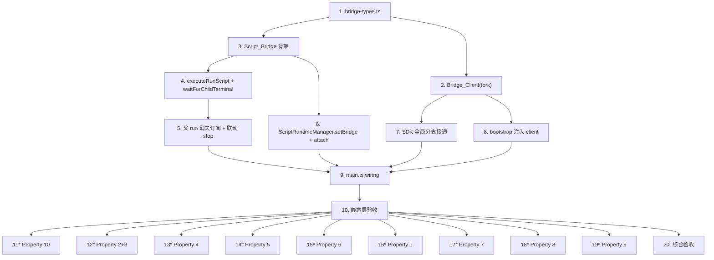

# Implementation Plan

## Overview

把 phase 6 的 design.md + requirements.md 翻译成可执行编码任务。落地路径如下:

1. **协议骨架先行(W1)**:把 `BridgeMethod / BridgeRequest / BridgeResponse / BridgeError`
   的纯类型 + fork 侧 Bridge_Client 实现先就位 —— 这两块没有外部依赖,可独立编译过。
2. **主进程 Script_Bridge(W2)**:在 W1 类型基础上实现路由器,持 `forks` 表 +
   pending children + 联动 stop;同步把 ScriptRuntimeManager 的 `setBridge` setter
   加上(避免循环依赖)。
3. **SDK 全局分支接通(W2,可与 Script_Bridge 并行)**:`createScriptApi` 全局
   profiles/runScript 分支改为走 Bridge_Client;bootstrap 注入 client。
4. **主进程 wiring + 渲染层 IPC 不动(W3)**:`main.ts` 构造 bridge、setBridge、
   `before-quit` 清理;不改 `scripts:run` 签名。
5. **构建与手动验证(W4)**:`pnpm run build` 全绿 + `tsc --noEmit ×2` 零错误 +
   按 design §11 + requirements 各 Property 跑人工剧本。

每条任务在改动文件里用**中文注释**写"为什么",对应项目惯例。不引入新依赖。
所有 Property 验证作为顶层 `*` 可选任务列出(项目无自动测试框架),执行体是
"按剧本人工跑一遍并把结果贴到回报里"。

## Tasks

- [x] 1. 定义 fork↔main IPC 协议类型骨架
  - 新增 `electron/scripts/bridge-types.ts`(纯类型,无运行时依赖,主进程 + fork
    两侧共享):导出 `BridgeMethod`(联合 `'profiles.list' | 'profiles.get' | 'runScript'`)、
    `BridgeRequest`、`BridgeResponse`、`BridgeError`、`BridgeErrorCode`,字段形状严格
    对齐 design §5.1 / §6.1。
  - 中文注释说明"为什么独立成类型文件":fork 侧 `bridge-client.ts` 与主进程侧
    `bridge.ts` 都要 import 这些类型,放第三方文件避免任一方导入对方运行时代码
    引发循环。
  - 不引入任何运行时代码。
  - _Requirements: 2.1, 6.1, 9.3, 10.1_

- [x] 2. 实现 fork 侧 Bridge_Client
  - 新增 `electron/scripts/sdk/bridge-client.ts`,导出
    `createBridgeClient(): BridgeClient`,接口形状对齐 design §5.2:
    `call<T>(method, payload): Promise<T>` + `dispose(reason)`。
  - 内部维护 `pending: Map<number, {resolve, reject}>` + `counter`(从 1 起单调递增)
    + `disposed` 标志。
  - `process.on('message')` 处理器只识别 `kind === 'response' && typeof id === 'number'`,
    其余形状静默丢弃 + `console.warn`(防御 fork 进程内存错乱)。
  - `process.send` 同步返回 `false` 时立即 reject 该 pending 并删表。
  - `dispose(reason)`:把 pending 表内所有条目以新建 Error 一次性 reject,清空表,
    置 `disposed=true`。
  - 中文注释:为什么 id 不用 UUID(进程内独占,counter 足够;~10^6/h 不会溢出)。
  - _Requirements: 2.1, 2.2, 2.3, 2.4, 2.5, 2.6, 9.1, 9.2_

- [x] 3. 实现主进程 Script_Bridge 模块
  - 新增 `electron/scripts/bridge.ts`,导出 `ScriptBridge` 类,构造签名对齐 design §5.1:
    `(runtime, scriptStore, profileStore, ensureProfileRunningForScript)`。
  - 内部状态:`forks: Map<runId, { child, pendingChildren: Set<{reqId, childRunId}> }>`。
  - 实现 `attach(child, ownerRunId)`:登记 forks 表 + `child.on('message', handleRequest)`
    + `child.on('exit', handleForkExit)`。即便 child 在 attach 调用过程中或之后立即 exit,
    也按"先登记 → exit 处理器自然清理"路径(对应 Requirement 3.4)。
  - 实现 `handleRequest(child, ownerRunId, message)`:
    1. 协议层校验(`kind==='request' && typeof id==='number' && method ∈ BridgeMethod`)
       不通过 → 静默丢弃 + warn,不发 RESPONSE。
    2. switch by method:`profiles.list` → `profileStore.list()`;`profiles.get` →
       `profileStore.get(id) ?? null`;`runScript` → 调 `executeRunScript`(任务 4)。
    3. 任意同步 / 异步异常 → 翻译为 BridgeError(`ProfileBusyError → PROFILE_BUSY`,
       其余 `INTERNAL_ERROR`),恰好发一条 RESPONSE。
  - 实现 `handleForkExit(ownerRunId)`:删 `forks[ownerRunId]`;对每条 pendingChildren
    先尝试发 SCRIPT_STOPPED RESPONSE(若 channel 已断,IPC `child.send` 同步返回
    false,静默忽略),再 `void runtime.stop(childRunId)`。
  - 实现 `shutdown()`:遍历 forks,对每个 fork 写 SCRIPT_STOPPED RESPONSE 给所有
    pendingChildren(尽力而为),清空表。app `before-quit` 时调。
  - 中文注释:为什么 bridge 独立模块而不是塞进 RuntimeManager(参见 design §5.1
    "为何独立成模块")。
  - _Requirements: 3.1, 3.2, 3.3, 3.4, 3.5, 10.1, 10.2_

- [x] 4. 在 Script_Bridge 中实现 `executeRunScript` + `waitForChildTerminal`
  - `executeRunScript(parentRunId, reqId, payload)` 严格对齐 design §7.3:
    1. `scriptStore.get(payload.scriptId)` → 不命中 SCRIPT_NOT_FOUND
    2. `script.scope === 'global'` → INVALID_SCOPE
    3. `profileStore.get(payload.profileId)` → 不命中 PROFILE_NOT_FOUND
    4. `await ensureProfileRunningForScript(profile)` 拿 wsUrl;若 throw → INTERNAL_ERROR
       (和 phase 1 既有路径一致)
    5. `await runtime.start({ script, profile, webSocketDebuggerUrl, triggeredBy:'global-script',
       parentRunId, params })`;若 throw `ProfileBusyError` → PROFILE_BUSY +
       `error.occupiedBy`
    6. 把 `{reqId, childRunId}` 加入 `forks[parentRunId].pendingChildren`
    7. `await waitForChildTerminal(childRunId, parentRunId)` 拿到 `{kind, run?}`
    8. `pendingChildren.delete` 本次条目
    9. 按 kind 发 RESPONSE:`'terminal'` → `{ ok:true, value:{run} }`;
       `'parent-stopped'` → `{ ok:false, error:{code:'SCRIPT_STOPPED', ...} }`
  - `waitForChildTerminal(childRunId, parentRunId)` 严格对齐 design §7.4:
    - 返回 `{ kind:'terminal', run }` 或 `{ kind:'parent-stopped' }`,**永不 reject**
    - 监听 `runtime.on('event')` 中的 `type === 'status'` 终态事件
    - 监听父 run 的"消失"事件(任务 5 提供的 hook)
    - 任一触发后 `runtime.off / unsubscribe` 清理另一边监听,避免泄漏
    - 'parent-stopped' 路径中 `void runtime.stop(childRunId)` fire-and-forget
  - 终态事件触发后,`run` 来自 `scriptStore.findRunById(childRunId)`(若该方法在
    store 中不存在,本任务顺手加一个简单查找;按既有 listRuns 数组扫一遍即可,
    不另开索引);找不到 → 用事件数据合成最小 ScriptRun(对应 design §错误场景 2)。
  - 中文注释:为什么 promise 永不 reject(让上层 algorithm 走单一汇合路径,
    避免 finally 复杂度)。
  - _Requirements: 4.1, 4.2, 4.3, 4.4, 4.5, 4.6, 4.7, 5.1, 5.2, 5.3, 5.4, 5.5, 6.5_

- [x] 5. 在 Script_Bridge 实现"父 run 消失"订阅 + 联动 stop
  - 在 ScriptBridge 构造函数中订阅 `runtime.on('event')`,监听
    `type === 'active-changed'` 事件;比较新旧 active runId 集合,对消失的
    runId 调 `onParentRunFinished(parentRunId)` 私有方法。
  - `onParentRunFinished(parentRunId)`:
    1. 取 `forks[parentRunId]` 的 pendingChildren 快照(可能为空)
    2. 对每个 pendingChildren 条目,触发 `waitForChildTerminal` 注册的
       parent-stopped 回调(任务 4 已挂)。这里实现"订阅总线":bridge 暴露
       `subscribeParentStopped(parentRunId, callback): unsubscribe`,内部维护
       `parentStoppedListeners: Map<parentRunId, Set<callback>>`;触发时调每个
       callback,清空。
  - 与 fork 'exit' 处理器(任务 3 中实现的 `handleForkExit`)互不冲突:exit 处理
    路径直接走"清表 + stop pending children + 写 SCRIPT_STOPPED";active-changed
    路径走 subscribeParentStopped 触发,后者主要服务于"父 run 已消失但 fork 还
    没 'exit'"的窗口期(graceful shutdown 阶段,Requirement 6.4)。
  - 中文注释:为什么需要两条路径而非合并(graceful 窗口期内 fork 还活,但 run 在
    runtime 视角已经"非活跃";单靠 fork exit 会让 SCRIPT_STOPPED 延迟 ≤3s 才送达,
    用户体验差)。
  - _Requirements: 6.1, 6.2, 6.3, 6.4_

- [x] 6. 改 `ScriptRuntimeManager`:加 `setBridge` + 在 fork 后 attach
  - 在 `electron/scripts/runtime.ts` 中:
    - 加私有字段 `private bridge: ScriptBridge | null = null` + 公开方法
      `setBridge(bridge: ScriptBridge): void { this.bridge = bridge }`。
    - 在 `start()` 内 `const child = fork(...)` 之后**立即**调
      `this.bridge?.attach(child, run.id)`(早于 `child.stdout?.on('data', ...)`
      等其它监听器,确保 attach 永远先于第一条可能到来的 child 'message')。
  - 中文注释:为什么用 setter 而不是构造函数注入(避免循环依赖 — bridge 也持
    runtime 引用)。
  - 不改 `start()` 的现有签名 / 现有行为分支。
  - _Requirements: 3.1, 3.5_

- [x] 7. SDK 接通 Bridge_Client(改 `electron/scripts/sdk/index.ts`)
  - 给 `ScriptContext` 类型加可选字段 `bridge: BridgeClient | null`(在
    `electron/scripts/sdk/types.ts` 定义);profile-scope 传 null 即可。
  - 重写 `makeGlobalScopeProfilesApi(bridge)`:
    - `list: () => bridge.call<BrowserProfile[]>('profiles.list', {})`
    - `get: (id) => bridge.call<BrowserProfile | null>('profiles.get', { id })`
    - `create / delete / setQueue` 仍 `notImplementedYet(...)`;调整
      `notImplementedYet` 的 message 含字符串 `phase 6.x`(对应 Requirement 8.2)。
  - 重写全局 scope 的 `runScript`:
    - `(scriptId, profileId, params) => bridge.call<RunScriptResult>('runScript',
      { scriptId, profileId, params: params ?? {} })`
    - 用 `try/catch` 把 bridge.call reject 的 BridgeError 包成 ScopeMismatchError
      (`new ScopeMismatchError(error.code, error.message)`),让用户 catch 时拿到
      一致 `e.code`。或者:bridge-client.ts 在 reject 时已经 reject 一个带 code
      的 plain object,SDK 这层 wrap 一次为 Error 实例,堆栈也好看。两种方案
      二选一,实现里取后者(Promise rejection 链上 wrap 一次)。
  - profile-scope 分支(`makeProfileScopeProfilesApi` + profile-scope `runScript`)
    保持不动 — 仍 reject `globalNotAvailable()`,确保 Requirement 7.2 不回归。
  - 中文注释:为什么写接口的 message 要带 `phase 6.x` 字样(Requirement 8.2)。
  - _Requirements: 1.1, 1.2, 1.3, 1.4, 5.6, 7.2, 8.1, 8.2, 8.3_

- [x] 8. 改 `bootstrap.ts`:在用户代码加载前注入 Bridge_Client
  - 在 `main()` 中 `readBootstrapEnv` / `readBootstrapArgs` 之后、
    `createScriptApi(context)` 之前:
    ```ts
    const bridge = createBridgeClient()
    context.bridge = bridge
    ```
  - 在既有 `process.on('disconnect')` 处理器里追加 `bridge.dispose('parent disconnected')`
    (注意:不能放在 `process.exit(1)` 之后,会到不了那行)。
  - 中文注释:为什么 bridge 必须先于 createScriptApi 注入(SDK factory 立刻就
    要 bridge 引用,迟了 profiles/runScript 拿到 null 就崩)。
  - _Requirements: 2.1, 2.6_

- [x] 9. 改 `electron/main.ts`:wiring + before-quit 清理
  - 在既有 `scriptRuntime = new ScriptRuntimeManager(scriptStore)` 之后,
    `ipcMain.handle('scripts:run', ...)` 之前,新增:
    ```ts
    const bridge = new ScriptBridge(scriptRuntime, scriptStore, store, ensureProfileRunningForScript)
    scriptRuntime.setBridge(bridge)
    ```
  - 在 `app.on('before-quit', ...)` 既有清理逻辑里追加 `bridge.shutdown()`,
    位置:在 `scriptRuntime.shutdown()` 之前(让 bridge 先 reject 所有 pending,
    再让 runtime 强杀子进程)。
  - **不改** `ipcMain.handle('scripts:run', ...)` 签名 / 实现 / 返回值
    (Requirement 7.1)。
  - 中文注释:为什么 wiring 顺序是 runtime → bridge → setBridge(bridge 构造时
    就要 runtime 引用,setBridge 是单向回填闭环)。
  - _Requirements: 7.1_

- [x] 10. Checkpoint - 静态层验收
  - 跑 `pnpm run build`,必须退出码 0(覆盖渲染层 vite + 主进程 tsc)
  - 跑 `npx tsc -p tsconfig.json --noEmit`,零错误
  - 跑 `npx tsc -p tsconfig.electron.json --noEmit`,零错误
  - `git diff package.json package-lock.json pnpm-lock.yaml` 确认未引入新依赖
    (Requirement 7.4)
  - 任一不通过 → 修复后再继续;有疑问就停下来问用户
  - _Requirements: 7.4, 7.5_

- [ ]* 11. 验证 Property 10(Correlation id 不串扰)的人工剧本
  - **Property 10: Correlation id 不串扰**
  - **Validates: Requirements 2.2, 2.3, 9.1, 9.2, 9.3**
  - 写一个临时全局脚本调
    `await Promise.all([profiles.list(), profiles.list(), profiles.get('xxx')])`,
    在 BridgeClient 与 ScriptBridge 两侧打开 console.log 串号 → 确认 RESPONSE.id 与
    REQUEST.id 一一对应,不串。

- [ ]* 12. 验证 Property 2 + Property 3(子 run 字段写入 + 终态承诺)
  - **Property 2: 子 run 调度链字段写入** | **Validates: Requirements 4.2, 4.6**
  - **Property 3: runScript 终态承诺** | **Validates: Requirements 4.4, 4.5**
  - 全局脚本调 `await runScript(sid, pid, {keyword:'demo'})`;子脚本里
    `log(args.parentRunId, args.triggeredBy, args.params.keyword)`;父脚本验证
    `result.run.status ∈ {succeeded, failed, stopped}`、`triggeredBy='global-script'`、
    `parentRunId` 命中。

- [ ]* 13. 验证 Property 4(错误码枚举闭合)
  - **Property 4: 错误码枚举闭合 + 映射**
  - **Validates: Requirements 5.1, 5.2, 5.3, 5.4, 5.5, 5.6**
  - 分别构造 5 种错误条件:不存在 scriptId / global-scope script / 不存在 profileId /
    profile 已被占用 / 故意 throw 让 INTERNAL_ERROR 触发(临时往 bridge 里插一行 throw,
    验证完移除)。每种验证 catch 块 `e.code` 命中。

- [ ]* 14. 验证 Property 5(停止传播)
  - **Property 5: 停止传播**
  - **Validates: Requirements 6.1, 6.2, 6.3, 6.4, 6.5**
  - 全局脚本里 `for (const p of profiles) await runScript(sid, p.id, {})`;
    在第 2-3 个子 run 跑到一半时点 stop 父 run。验证:1) 当前子 run 立刻
    stopped(active 抽屉消失);2) 父 fork 日志含 `SCRIPT_STOPPED`;3) 用户脚本
    `try { await runScript(...) } catch (e) { log(e.code) }` log 出 SCRIPT_STOPPED。

- [~]* 15. 验证 Property 6(Fork exit 清理)
  - **Property 6: Fork exit 清理**
  - **Validates: Requirements 3.3, 3.4**
  - 测三种 fork 退出场景:1) 用户主动 stop 父 fork(等价 14 路径);
    2) 全局脚本正常 return;3) 全局脚本 `process.exit(2)` 模拟崩溃。每种验证:
    主进程日志显示 forks 表条目被删 + pending 子 run 被 stop。

- [ ]* 16. 验证 Property 1(Profiles 只读 API 与 Profile_Store 同源)
  - **Property 1: Profiles 只读 API 与 Profile_Store 同源**
  - **Validates: Requirements 1.1, 1.2, 1.3, 1.4**
  - 准备 ≥ 2 个 profile(其中至少一个含非空 `enabledPluginIds` /
    `proxyId` / `onCreateQueue` / `onLaunchQueue`),全局脚本中
    `JSON.stringify(await profiles.list())` 与渲染层 `window.registry.profiles.list()`
    在主进程同一时刻拿到的字段对照,断言完全相等。`profiles.get('not-exist')`
    返回 `null`(不 throw)。

- [ ]* 17. 验证 Property 7(写接口仍占位且无副作用)
  - **Property 7: 写接口仍占位且无副作用**
  - **Validates: Requirements 8.1, 8.2, 8.3**
  - 全局脚本调 `profiles.create({name:'x'})` / `profiles.delete('x')` /
    `profiles.setQueue('x','on-launch',[])`,验证 catch 后:1) `e.code === 'GLOBAL_NOT_IMPL_YET'`;
    2) `e.message` 含 `phase 6.x`;3) 主进程 ScriptBridge 日志无对应 method 处理记录
    (因为 Bridge_Client 端就 throw 了,不会走 process.send)— 用 `console.log` 在
    Bridge_Client.call 入口打点确认无该 method 通过。

- [ ]* 18. 验证 Property 8(Profile-scope 不变量)
  - **Property 8: Profile-scope SDK 不变量(回归保护)**
  - **Validates: Requirements 7.2**
  - 在一个 profile-scope 脚本里调 `profiles.list()` / `profiles.get('x')` /
    `profiles.create({name:'a'})` / `profiles.delete('a')` /
    `profiles.setQueue('a','on-launch',[])` / `runScript('a','b',{})`,共 6 次。
    每次 catch 后断言 `e.code === 'GLOBAL_NOT_AVAILABLE'`。

- [ ]* 19. 验证 Property 9(PROFILE_BUSY 互斥规则保留)
  - **Property 9: PROFILE_BUSY 互斥规则保留(回归保护)**
  - **Validates: Requirements 5.4, 7.3**
  - 准备一个 profile-scope 脚本"长跑"(比如 `await sleep(60_000)`)。手动 run
    它占用 profile,然后从全局脚本里 `runScript(sid, pid, {})` → catch 后断言
    `e.code === 'PROFILE_BUSY' && e.occupiedBy.runId === <长跑 run id>`。

- [x] 20. Final checkpoint - 综合手动验收
  - 按 design §11 phase 6 的"集成测试"剧本完整跑一遍:
    1. 创建 2 个 profile + 1 个 profile-scope 子脚本(`log(args.params, args.triggeredBy, args.parentRunId)`)
       + 1 个全局脚本(design §8.1 的 Example Usage)
    2. 跑全局脚本 → 子 run 依次出现在 ActiveRunsButton 抽屉
    3. 子脚本 log 命中预期值
    4. 中途 stop 父 run → 正在跑的子 run 立刻 stopped + 父 fork log 含 `SCRIPT_STOPPED`
    5. 把全局脚本里 `runScript('nope', ...)` → 父 fork log 含 `SCRIPT_NOT_FOUND`
  - 任何不符合预期 → 在回报里指明 + 暂停后续任务,等用户决策
  - _Requirements: 1.1-1.4, 4.1-4.7, 5.1-5.6, 6.1-6.5_

## Notes

- 标 `*` 的任务(11-19)是 Property 验证人工剧本,属可选 — 可以先把核心实装(1-10)
  和综合验收(20)跑通再补,也可以与对应的实装任务并行验证;不强制阻塞主线推进。
- 项目无自动测试框架 → 静态层验收靠 task 10(build + tsc),动态层验收靠
  task 20 的人工剧本。phase 6 不引入测试框架(超出范围)。
- 不要修改 `electron/main.ts` 里 `ipcMain.handle('scripts:run', ...)` 的签名
  与实现 — 渲染层 IPC 不在本阶段范围(Requirement 7.1)。
- 不要触碰 `profiles.create` / `profiles.delete` / `profiles.setQueue` 的真正
  实装 — 仍走 `notImplementedYet` 占位(Requirement 8.1);本阶段只调整 message
  让它含 `phase 6.x` 字样(Requirement 8.2)。
- 改动文件清单(预期):
  - 新增:`electron/scripts/bridge-types.ts`、`electron/scripts/bridge.ts`、
    `electron/scripts/sdk/bridge-client.ts`
  - 改动:`electron/scripts/runtime.ts`(setBridge + attach)、
    `electron/scripts/bootstrap.ts`(注入 bridge client)、
    `electron/scripts/sdk/index.ts`(SDK 全局分支接通)、
    `electron/scripts/sdk/types.ts`(ScriptContext 加 bridge 字段)、
    `electron/main.ts`(wiring + before-quit)
- 中文注释覆盖率:每个新增 / 改动函数都要有中文 comment 说明"为什么这么写",
  与 phase 1/2/3 的代码风格保持一致。

## Task Dependency Graph

依赖关系按 wave 划分,同一 wave 内任务可并行执行(无相互依赖)。Property
验证任务(11-19)只依赖前置实装,彼此独立,可全部并行;均为可选(`*`)。



**波形(并行执行单元)**:

- **Wave W1** — 协议骨架: T1
- **Wave W2** — 类型基础上的两端实现: T2, T3
- **Wave W3** — bridge 完整功能 + SDK / bootstrap: T4, T6, T7, T8
- **Wave W4** — 父子 run 联动: T5
- **Wave W5** — wiring: T9
- **Wave W6** — 静态层验收: T10
- **Wave W7** — Property 验证(可选,可全并行): T11*..T19*
- **Wave W8** — 综合验收: T20

```json
{
  "waves": [
    { "id": "W1", "tasks": ["1"] },
    { "id": "W2", "tasks": ["2", "3"] },
    { "id": "W3", "tasks": ["4", "6", "7", "8"] },
    { "id": "W4", "tasks": ["5"] },
    { "id": "W5", "tasks": ["9"] },
    { "id": "W6", "tasks": ["10"] },
    { "id": "W7", "tasks": ["11", "12", "13", "14", "15", "16", "17", "18", "19"] },
    { "id": "W8", "tasks": ["20"] }
  ]
}
```
